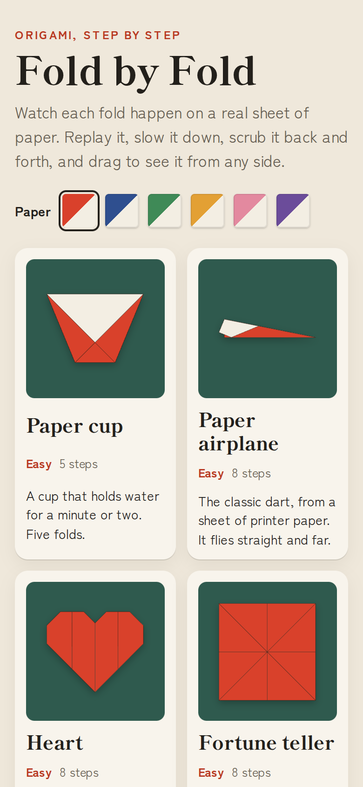
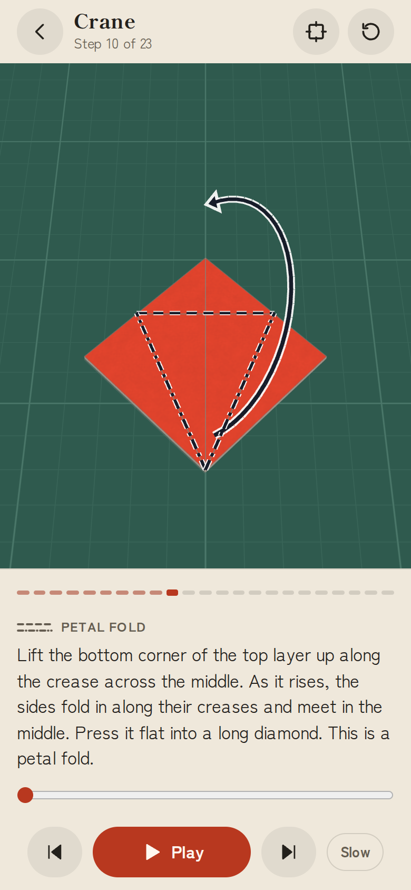
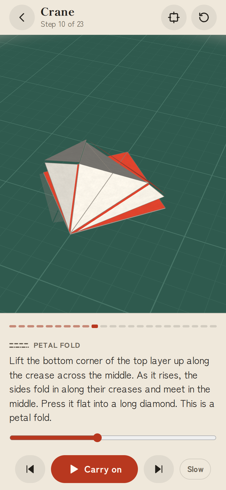

# Fold by Fold

**Play it: [junkdrawer.works/fold-by-fold](https://junkdrawer.works/fold-by-fold/)**

**Origami instructions that fold in front of you.** A printed diagram shows a fold as a dashed line and an arrow, and it's up to you to work out which way the paper goes. Here, each step is a real sheet of paper folding in 3D. Watch it, replay it, slow it down, stop it halfway, and drag to look at it from the side or underneath.

<p align="center">
  
  &nbsp;
  
  &nbsp;
  
</p>

## How it works

- **Pick a model.** A paper cup, a paper airplane, a heart, a fortune teller, a samurai helmet and the traditional crane, from five steps to twenty-three. Pick a paper colour too; the back of the paper is always white, as it is with origami paper.
- **The crane has the folds drawings make hardest.** Collapsing the square base, where six creases close at once. Petal folds, where a corner lifts and its sides fold in to meet under it. Inside reverse folds for the neck, tail and head, where a thin flap turns inside out and tucks up between its own layers. Each one plays as a single motion, and you can stop it anywhere.
- **Each step starts as a diagram.** Before a fold, the paper shows the marks a printed diagram would: a dashed line for a valley fold (toward you), dashes and dots for a mountain fold (behind), and an arrow for which way it goes. The name of the fold and what to do are written underneath.
- **Press Play and it folds.** The flap turns over about the crease and lands on its new layer, and the next step waits for you. Slow makes every fold take a little over twice as long.
- **Scrub it.** The slider under the words is the fold itself: drag it to stop the paper anywhere between flat and folded, and back.
- **Turn it around.** Drag the paper to see it from any side, pinch or scroll to zoom, and double-tap to put the view back. The square button looks straight down, the way a diagram does.
- **It remembers where you got to** in each model, and the paper colour. A link can go straight to a step: `#helmet-6` is step 6 of the helmet.
- No account and no server. It works offline and installs to a phone's home screen.

The paper is modelled the way it really folds, not drawn as a picture. The sheet is a set of flat pieces, each one knowing where it sits on the table, whether it's turned over, and what's above and below it. A fold cuts every piece it crosses, turns over the pieces on the moving side, and stacks them in the right order. That same model drives the 3D animation, the diagram marks and the pictures of the finished models, so they can't disagree.

## Running it

It's a static site: plain HTML, CSS and JavaScript modules, with no build step.

```sh
npx serve .                   # or any static file server, then open the printed address
npm install                   # only for the tools below: esbuild and upng-js
npm test                      # the folding engine (Node 20+), then the real page in Chromium (needs Playwright)
node tools/screenshots.mjs    # redraws docs/*.png and og.png
node tools/make-icons.mjs     # redraws the PNG icons from icon.svg
npm run build                 # dist/fold-by-fold.html, the whole thing in one file
```

Opening `index.html` straight from disk won't work, because browsers block JavaScript modules on `file://`. The built file does work that way.

To put it online with GitHub Pages: **Settings → Pages → Build and deployment → Deploy from a branch**, then pick `main` and `/ (root)`.

### Adding a model

A model is a list of steps in `js/models.js`, each with the words to show and the fold to make, written the way a diagram would put it. Points are given on the flat, unfolded paper (`[0, 0]` is one corner, `[1, 1]` the opposite one), and the helpers work out where they are now:

```js
{
  say: 'Fold the bottom corner up to the top corner.',
  do: (h) => h.valley(h.onto([1, 0], [0, 1]), { move: [1, 0] }),
}
```

`h.valley` and `h.mountain` fold, `h.crease` folds and unfolds, `h.together` makes several folds at once, and `h.turnOver` and `h.turn` move the whole model. `h.mech` closes several creases as one linked motion, for collapses and petal folds, and `h.reverse` makes an inside reverse fold. `move` names a point on the part that moves; `flap` instead folds just the layer holding that point, and whatever is joined to it. `npm test` folds every step of every model and checks that nothing passes through the table and every animation lands exactly where the fold says.

A collapse or petal fold is worked out as a mechanism: the paper between the moving creases is rigid, the creases are hinges, and a small solver keeps every loop of hinges closed while the main crease follows its schedule and the rest go wherever the paper takes them. An inside reverse fold can't be made that way, because real paper bends a little to let the tip slip between the layers. There the tip swings round the point where the crease meets its folded edge and turns over along that edge as it goes, then settles exactly into its place between the layers.

### Files

- `js/geom.js`: points, lines, polygons and the flat moves between them.
- `js/paper.js`: the folded sheet, and folding it: cutting pieces along the crease, working out which layers move, and restacking them. Inside reverse folds are here too.
- `js/mech.js`: folds where several creases move at once, solved as rigid pieces joined by hinges.
- `js/build.js`: turns a model's steps into the folded states between them. `js/models.js`: the models.
- `js/motion.js`: where every piece of paper is, in 3D, at any moment of a fold, and the diagram marks for it.
- `js/render.js`: the WebGL drawing: two-sided paper, the cutting mat, shadows, the marks and the camera.
- `js/thumbs.js`: the flat pictures of each finished model. `js/app.js`: the page, the player and its controls.
- `fonts/`: Shippori Mincho B1 and Zen Kaku Gothic New (SIL Open Font License), served from here so nothing loads from elsewhere.
- `sw.js`: keeps a copy for using offline. `npm test` checks that it lists every file the page needs.
- `tools/`: the screenshot and icon scripts. `scripts/build.mjs`: the single-file build.
